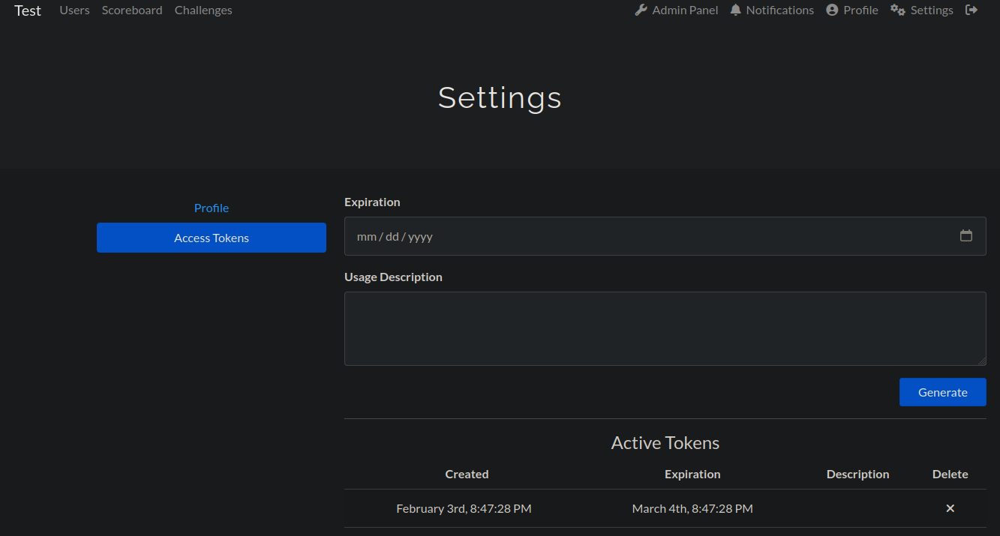

# Installation

## Install the environment
Create a virtual environment:
```console
python -m venv venv 
source venv/bin/activate
```

To use the wrapper, first install it using pip:
```console
pip install ctfd-wrapper-0.3.1-py3-none-any.whl
```

## Install CTFd
To use or to test the wrapper, it is needed to have a running instance of the CTFd project. The CTFd can be found on
[GitHub](https://github.com/CTFd/CTFd). It can be installed with docker:

```shell
git clone https://github.com/CTFd/CTFd.git
cd CTFd
docker run -p 8000:8000 -it ctfd/ctfd
```

Create a CTF by following the instructions, then generate a token on the `Settings` page:


Once the token has been generated, create an `.env` file at the root of the project with the token inside:
```dotenv
TOKEN=ctfd_6327657374206c6520746f6b656e207375706572207365637265742021
```
